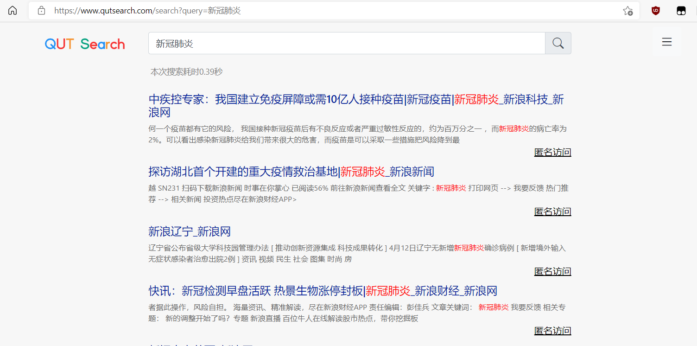
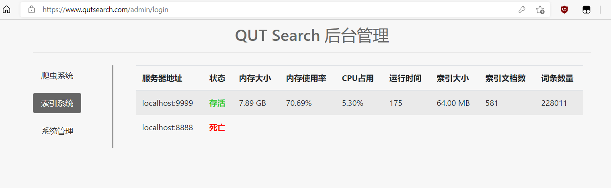

# 一个保护使用者隐私地搜索引擎

本科毕业设计，使用Go语言开发，从零实现了通用网络爬虫和倒排索引引擎，论文里有对搜索引擎实现的讲解。

三个文件夹 crawler、index和web分别对应三个子项目：
- crawler 包含爬虫系统、通过将网站服务器IP进行哈希取余地方式，使得爬虫可以以无限高地速度去爬取整个万维网，而不用担心收到访问限制。
- index 实现了倒排索引引擎，参考《自制搜索引擎》一书，加入了并发构建、结果高亮，对项目接口做了调整。
- web 是网站后端，借助 Redis 实现了简单的分布式节点的注册、发现、访问、和死亡节点的清除机制，同时实现了隐私匿名代理服务（参考了github.com/asciimoo/morty）用保护使用者隐私。

https://localhost 首页， https://localhost/admin 后台，

### 运行截图



### 配置文件
**index - index.properties**
```properties
#MySQL用户名
mysql.username=root
#MySQL密码
mysql.password=root
#MySQL主机地址
mysql.host=localhost
#MySQL端口
mysql.port=3306
#MySQL数据库名
mysql.dbname=search-engine-config
#倒排索引数据文件地址
boltdb.indexPath=E:\boltdb\search-engine-indexdb.db
#网页文档库文件地址
boltdb.docPath=E:\boltdb\search-engine-docdb.db
#redis地址
redis.addr=localhost:6379
#索引服务器监听的地址
indexer.listenAddr=localhost:8888
#文档ID-文档URL的缓存大小
indexer.docUrlBufferSize=100000
#倒排列表缓存大小
indexer.postingsBufferSize=100000
#词元-文档数量缓存大小
indexer.tokenDocCountBufferSize=100000
#indexer协程数目
indexer.indexWorkerCount=5
#flusher协程数目
indexer.flushWorkerCount=5
#indexChannel大小
indexer.indexChannelLength=1000
#mergeChannel大小
indexer.mergeChannelLength=1000
#flushChannel大小
indexer.flushChannelLength=10
#倒排索引缓存刷新阈值
indexer.postingsBufferFlushThreshold=1000
```

**crawler - crawler.properties**
```properties
#MySQL配置
mysql.username=root
mysql.password=root
mysql.dbname=search-engine-config
mysql.host=localhost
mysql.port=3306
#爬虫协程数量
crawler.goroutineCount=100
#种子URL，逗号分隔
crawler.seedUrls=http://www.qut.edu.cn,https://www.sina.com.cn
#索引服务器的接口地址
indexer.addr=http://localhost:8888/index
#爬虫服务器的监听地址
crawler.listenAddr=localhost:8899
#单机调度或者分布式调度，single单机调度，distributed分布式调度
crawler.scheduler=distributed
#redis服务器地址
redis.addr=localhost:6379
```

**web - config.properties**
```properties
#MySQL配置
mysql.username=root
mysql.password=root
mysql.dbname=search-engine-config
mysql.host=localhost
mysql.port=3306
#redis服务器地址
redis.addr=localhost:6379
#监听地址，必须使用443端口，https协议
web.listenAddr=:443
```
